# Entity-Relationship Diagram

This document describes the data model and entity relationships within the `trahist` portfolio tracking system, **focusing on raw broker data structures** and their transformation to the unified schema.

## Raw Data → Unified Schema Overview

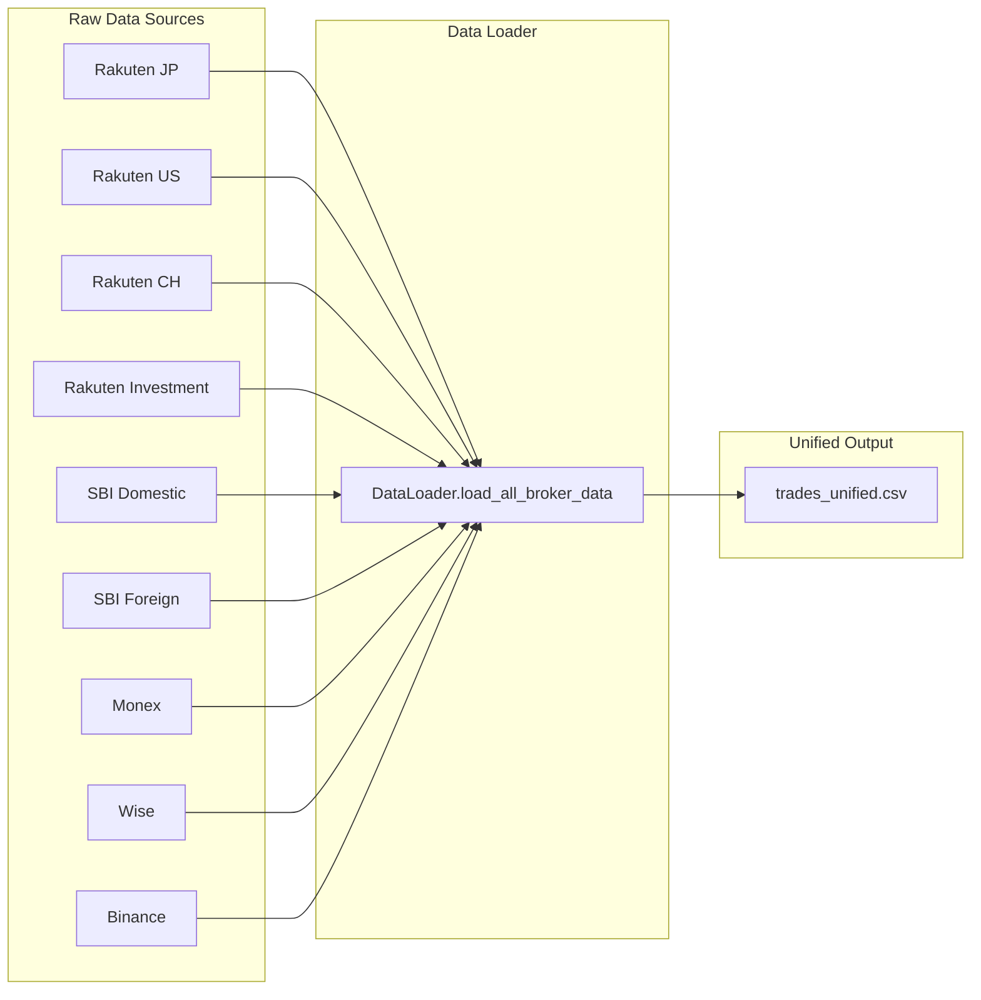
```mermaid
flowchart LR
    subgraph Raw Data Sources
        R1[Rakuten JP] 
        R2[Rakuten US]
        R3[Rakuten CH]
        R4[Rakuten Investment]
        S1[SBI Domestic]
        S2[SBI Foreign]
        M[Monex]
        W[Wise]
        B[Binance]
    end

    subgraph Data Loader
        L[DataLoader.load_all_broker_data]
    end

    subgraph Unified Output
        U[trades_unified.csv]
    end

    R1 --> L
    R2 --> L
    R3 --> L
    R4 --> L
    S1 --> L
    S2 --> L
    M --> L
    W --> L
    B --> L
    L --> U
```

---

## Raw Broker Data Schemas

### Rakuten Securities - Japanese Stocks (JP)
**File Pattern:** `tradehistory(JP)_*.csv`  
**Encoding:** Shift-JIS

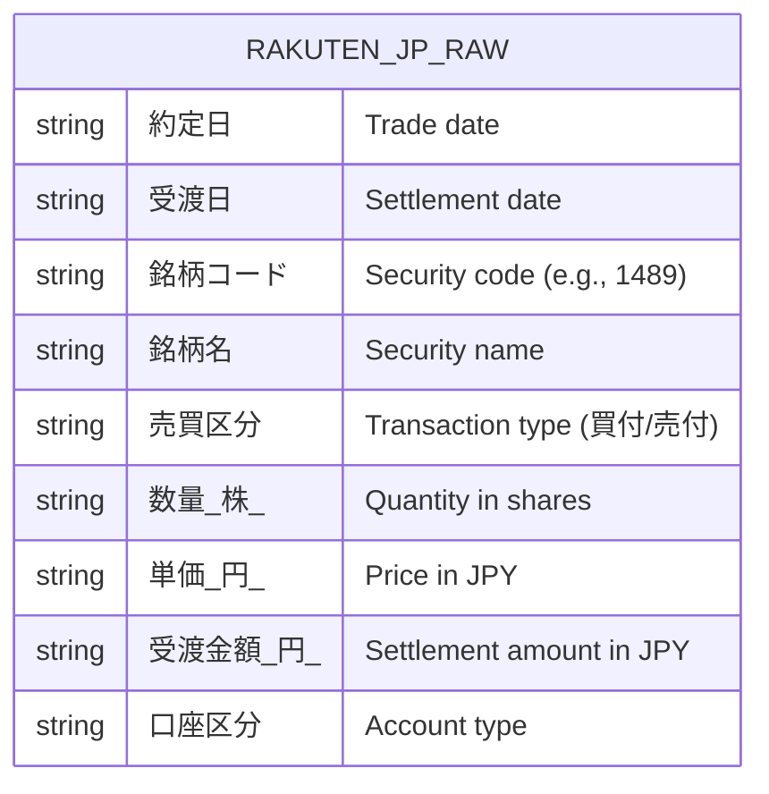
```mermaid
erDiagram
    RAKUTEN_JP_RAW {
        string 約定日 "Trade date"
        string 受渡日 "Settlement date"
        string 銘柄コード "Security code (e.g., 1489)"
        string 銘柄名 "Security name"
        string 売買区分 "Transaction type (買付/売付)"
        string 数量_株_ "Quantity in shares"
        string 単価_円_ "Price in JPY"
        string 受渡金額_円_ "Settlement amount in JPY"
        string 口座区分 "Account type"
    }
```

| Raw Column (Japanese) | → Unified Column | Notes |
|-----------------------|------------------|-------|
| `約定日` | `trade_date` | Parsed with date_formats |
| `受渡日` | `settlement_date` | |
| `銘柄コード` | `security_code` | Formatted as `xxxx.JP` |
| `銘柄名` | `security_name` | |
| `売買区分` | `transaction_type` | 買付→buy, 売付→sell |
| `数量［株］` | `quantity` | |
| `単価［円］` | `price` | |
| `受渡金額［円］` | `settlement_amount` | |
| `口座区分` | `account_type` | |
| *(auto)* | `currency` | Set to `JPY` |

---

### Rakuten Securities - US Stocks (US)
**File Pattern:** `tradehistory(US)_*.csv`  
**Encoding:** Shift-JIS

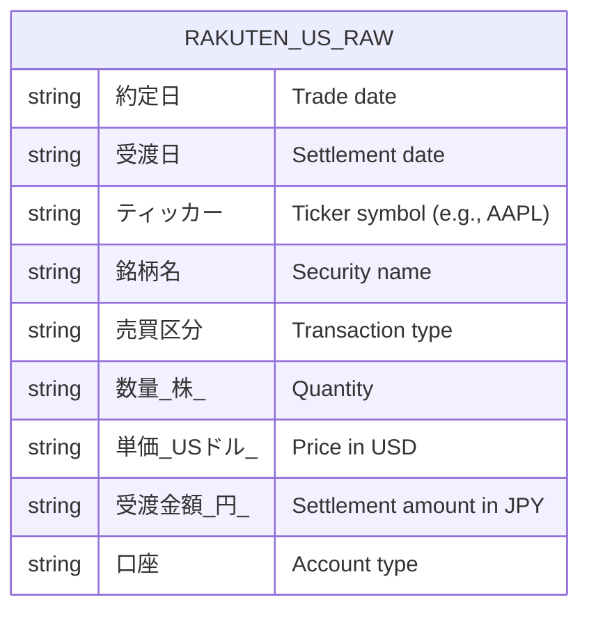
```mermaid
erDiagram
    RAKUTEN_US_RAW {
        string 約定日 "Trade date"
        string 受渡日 "Settlement date"
        string ティッカー "Ticker symbol (e.g., AAPL)"
        string 銘柄名 "Security name"
        string 売買区分 "Transaction type"
        string 数量_株_ "Quantity"
        string 単価_USドル_ "Price in USD"
        string 受渡金額_円_ "Settlement amount in JPY"
        string 口座 "Account type"
    }
```

| Raw Column (Japanese) | → Unified Column | Notes |
|-----------------------|------------------|-------|
| `約定日` | `trade_date` | |
| `受渡日` | `settlement_date` | |
| `ティッカー` | `security_code` | US ticker symbol |
| `銘柄名` | `security_name` | |
| `売買区分` | `transaction_type` | |
| `数量［株］` | `quantity` | |
| `単価［USドル］` | `price` | In USD |
| `受渡金額［円］` | `settlement_amount` | |
| `口座` | `account_type` | |
| *(auto)* | `currency` | Set to `USD` |

---

### Rakuten Securities - China/HK Stocks (CH)
**File Pattern:** `tradehistory(CH)_*.csv`  
**Encoding:** Shift-JIS

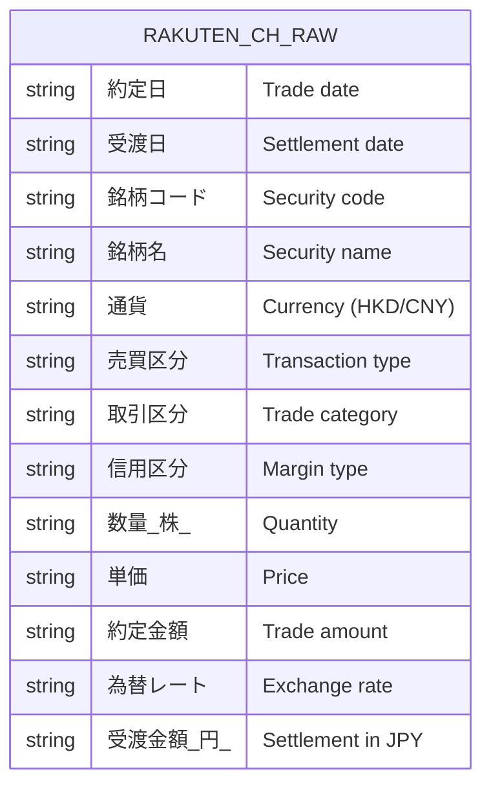
```mermaid
erDiagram
    RAKUTEN_CH_RAW {
        string 約定日 "Trade date"
        string 受渡日 "Settlement date"
        string 銘柄コード "Security code"
        string 銘柄名 "Security name"
        string 通貨 "Currency (HKD/CNY)"
        string 売買区分 "Transaction type"
        string 取引区分 "Trade category"
        string 信用区分 "Margin type"
        string 数量_株_ "Quantity"
        string 単価 "Price"
        string 約定金額 "Trade amount"
        string 為替レート "Exchange rate"
        string 受渡金額_円_ "Settlement in JPY"
    }
```

| Raw Column (Japanese) | → Unified Column | Notes |
|-----------------------|------------------|-------|
| `約定日` | `trade_date` | |
| `通貨` | `currency` | HKD/CNY |
| `銘柄コード` | `security_code` | |
| `為替レート` | `exchange_rate` | Rate to JPY |
| `約定金額` | `amount` | In original currency |
| *(default)* | `currency` | Defaults to `HKD` |

---

### Rakuten Securities - Investment Funds (INVST)
**File Pattern:** `tradehistory(INVST)_*.csv`  
**Encoding:** Shift-JIS

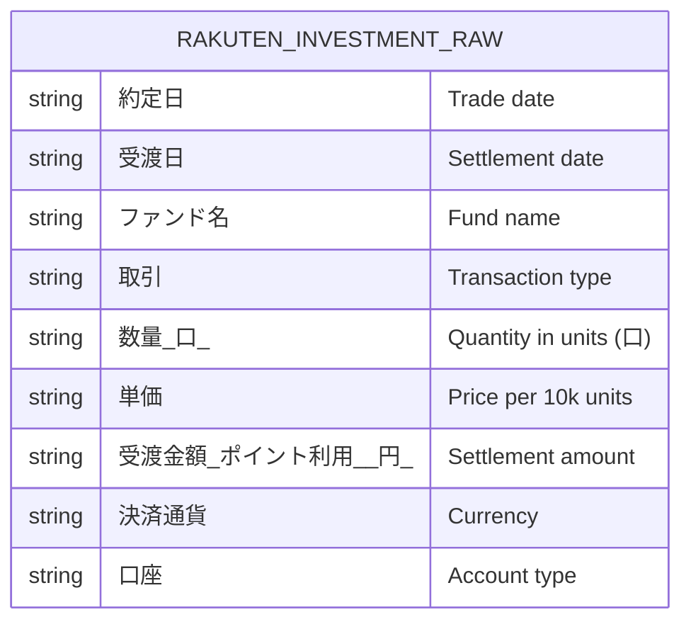
```mermaid
erDiagram
    RAKUTEN_INVESTMENT_RAW {
        string 約定日 "Trade date"
        string 受渡日 "Settlement date"
        string ファンド名 "Fund name"
        string 取引 "Transaction type"
        string 数量_口_ "Quantity in units (口)"
        string 単価 "Price per 10k units"
        string 受渡金額_ポイント利用__円_ "Settlement amount"
        string 決済通貨 "Currency"
        string 口座 "Account type"
    }
```

| Raw Column (Japanese) | → Unified Column | Notes |
|-----------------------|------------------|-------|
| `約定日` | `trade_date` | |
| `ファンド名` | `security_name` | Japanese fund name |
| `取引` | `transaction_type` | 買付/再投資→buy |
| `数量［口］` | `quantity` | **10k Rule applies** |
| `単価` | `price` | Per 10,000 units |
| `受渡金額/(ポイント利用)[円]` | `settlement_amount` | |
| `決済通貨` | `currency` | |
| *(missing)* | `security_code` | Set to empty string |

> **⚠️ 10k Rule:** Japanese investment trusts quote quantity in 口 (units). To calculate market value:
> `Market Value = (Quantity / 10000) × Current Price`

---

### SBI Securities - Domestic Stocks
**File Pattern:** `SaveFile*.csv`  
**Encoding:** Shift-JIS  
**Note:** Skip first 8 rows (header metadata)

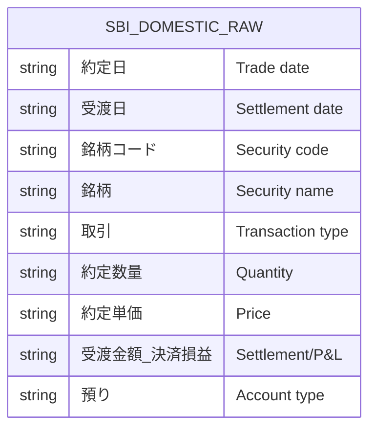
```mermaid
erDiagram
    SBI_DOMESTIC_RAW {
        string 約定日 "Trade date"
        string 受渡日 "Settlement date"
        string 銘柄コード "Security code"
        string 銘柄 "Security name"
        string 取引 "Transaction type"
        string 約定数量 "Quantity"
        string 約定単価 "Price"
        string 受渡金額_決済損益 "Settlement/P&L"
        string 預り "Account type"
    }
```

| Raw Column (Japanese) | → Unified Column | Notes |
|-----------------------|------------------|-------|
| `約定日` | `trade_date` | |
| `銘柄コード` | `security_code` | |
| `銘柄` | `security_name` | Note: 銘柄 not 銘柄名 |
| `取引` | `transaction_type` | |
| `約定数量` | `quantity` | |
| `約定単価` | `price` | |
| `受渡金額/決済損益` | `settlement_amount` | |
| `預り` | `account_type` | |
| *(auto)* | `currency` | Set to `JPY` |

---

### SBI Securities - Foreign Stocks
**File Pattern:** `yakujo*.csv`  
**Encoding:** Shift-JIS  
**Note:** Skip first 2 rows

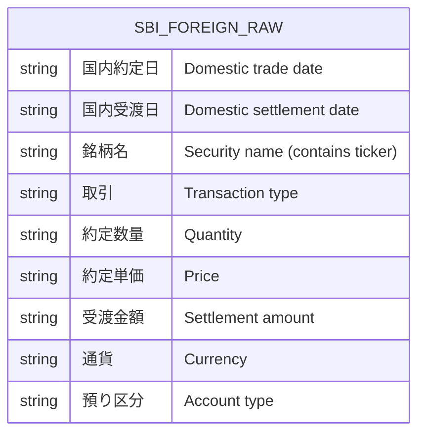
```mermaid
erDiagram
    SBI_FOREIGN_RAW {
        string 国内約定日 "Domestic trade date"
        string 国内受渡日 "Domestic settlement date"
        string 銘柄名 "Security name (contains ticker)"
        string 取引 "Transaction type"
        string 約定数量 "Quantity"
        string 約定単価 "Price"
        string 受渡金額 "Settlement amount"
        string 通貨 "Currency"
        string 預り区分 "Account type"
    }
```

| Raw Column (Japanese) | → Unified Column | Notes |
|-----------------------|------------------|-------|
| `国内約定日` | `trade_date` | |
| `国内受渡日` | `settlement_date` | |
| `銘柄名` | `security_name` | Contains ticker in text |
| *(extracted)* | `security_code` | Regex: `([A-Z]{1,5}(?:\.[A-Z])?)` |
| `取引` | `transaction_type` | |
| `約定数量` | `quantity` | |
| `約定単価` | `price` | |
| `受渡金額` | `settlement_amount` | |
| `通貨` | `currency` | |
| `預り区分` | `account_type` | |

---

### Monex Securities
**File Pattern:** `monex*.csv`  
**Encoding:** Shift-JIS  
**Note:** Skip first 1 row (creation date header)

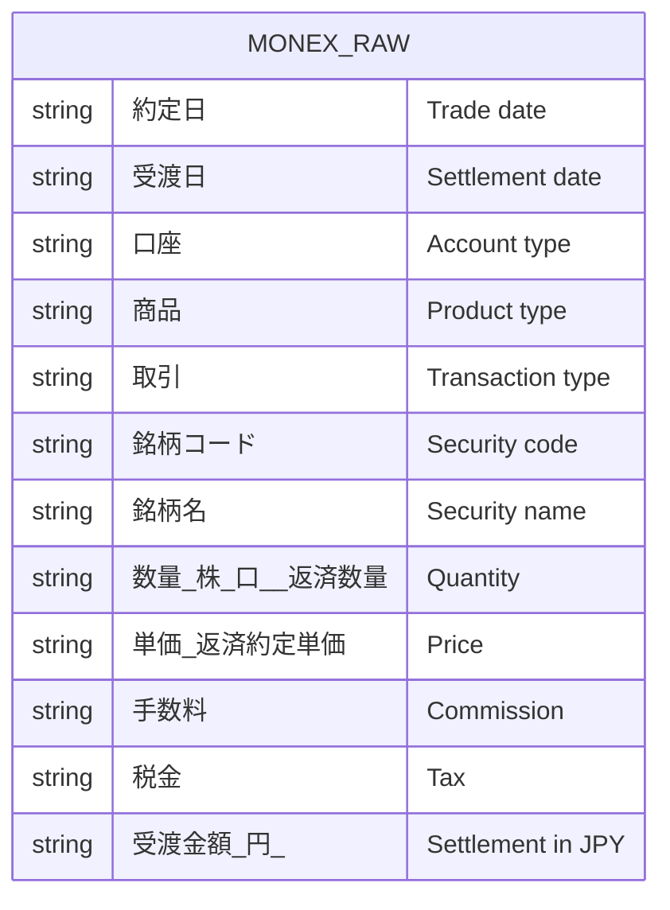
```mermaid
erDiagram
    MONEX_RAW {
        string 約定日 "Trade date"
        string 受渡日 "Settlement date"
        string 口座 "Account type"
        string 商品 "Product type"
        string 取引 "Transaction type"
        string 銘柄コード "Security code"
        string 銘柄名 "Security name"
        string 数量_株_口__返済数量 "Quantity"
        string 単価_返済約定単価 "Price"
        string 手数料 "Commission"
        string 税金 "Tax"
        string 受渡金額_円_ "Settlement in JPY"
    }
```

| Raw Column (Japanese) | → Unified Column | Notes |
|-----------------------|------------------|-------|
| `約定日` | `trade_date` | |
| `受渡日` | `settlement_date` | |
| `口座` | `account_type` | |
| `商品` | `product_type` | |
| `取引` | `transaction_type` | Filter: 買付/売付 only |
| `銘柄コード` | `security_code` | Cast to string |
| `銘柄名` | `security_name` | **Filter: Exclude MRF** |
| `数量（株/口）/返済数量` | `quantity` | |
| `単価/返済約定単価` | `price` | |
| `手数料` | `commission` | |
| `税金(手数料消費税及び譲渡益税)` | `tax` | |
| `受渡金額(円)` | `settlement_amount` | |
| *(auto)* | `currency` | Set to `JPY` |

> **⚠️ Exclusions:**
> - Filter out MRF (Money Reserve Fund) records - cash management, not investments
> - Keep only `取引` containing "買付" or "売付"

---

### Wise (TransferWise) - Stock Activity
**File Pattern:** `wise_stock_*.csv`  
**Encoding:** UTF-8

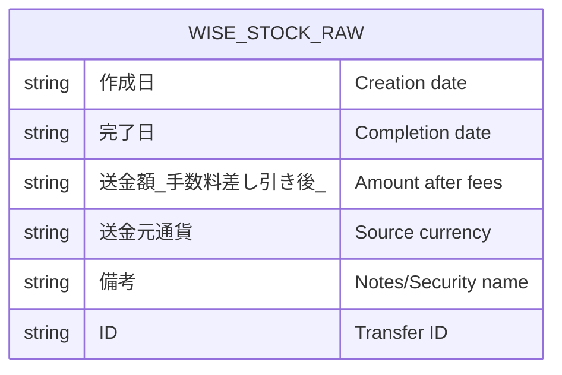
```mermaid
erDiagram
    WISE_STOCK_RAW {
        string 作成日 "Creation date"
        string 完了日 "Completion date"
        string 送金額_手数料差し引き後_ "Amount after fees"
        string 送金元通貨 "Source currency"
        string 備考 "Notes/Security name"
        string ID "Transfer ID"
    }
```

| Raw Column (Japanese) | → Unified Column | Notes |
|-----------------------|------------------|-------|
| `作成日` | `trade_date` | |
| `完了日` | `settlement_date` | |
| `送金額（手数料差し引き後）` | `amount` | After fees |
| `送金元通貨` | `currency` | |
| `備考` | `security_name` | |
| `ID` | *(check for ASSETS)* | Used to detect asset transfers |

> **Note:** Only `wise_stock_*.csv` files are processed. Regular payment files are skipped.

---

### Binance (Crypto)
**File Pattern:** `binance*.zip` (contains `.xlsx`)  
**Encoding:** UTF-8/Excel

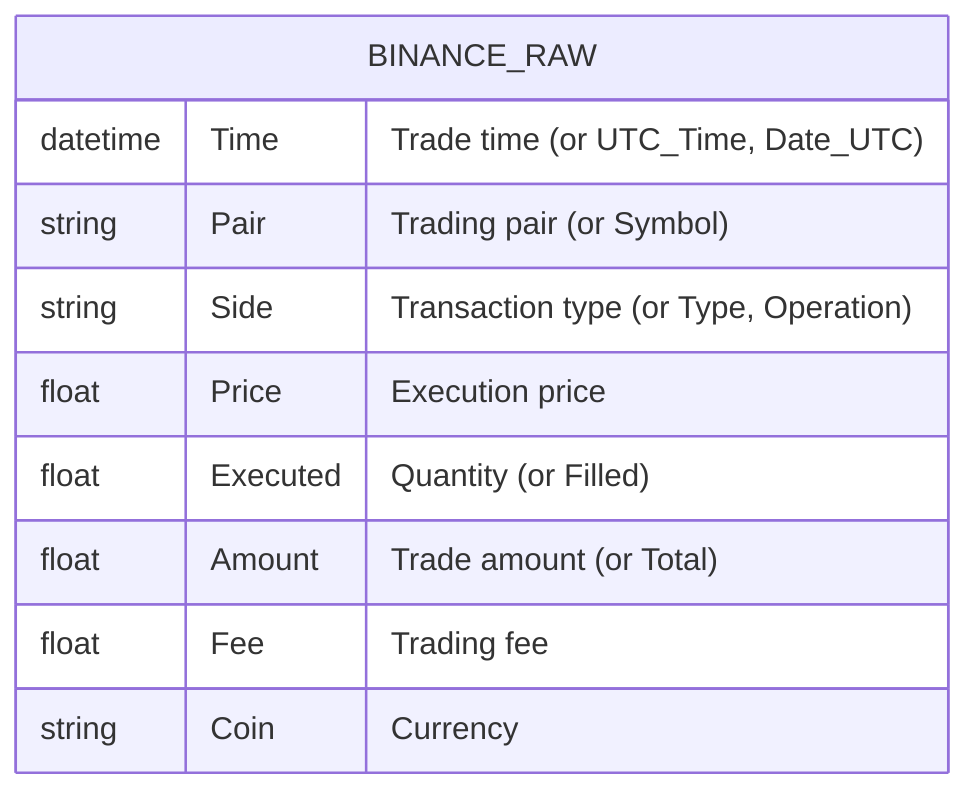
```mermaid
erDiagram
    BINANCE_RAW {
        datetime Time "Trade time (or UTC_Time, Date_UTC)"
        string Pair "Trading pair (or Symbol)"
        string Side "Transaction type (or Type, Operation)"
        float Price "Execution price"
        float Executed "Quantity (or Filled)"
        float Amount "Trade amount (or Total)"
        float Fee "Trading fee"
        string Coin "Currency"
    }
```

| Raw Column | → Unified Column | Notes |
|------------|------------------|-------|
| `Time` / `UTC_Time` / `Date(UTC)` | `trade_date` | |
| `Pair` / `Symbol` | `security_code` | |
| `Side` / `Type` / `Operation` | `transaction_type` | BUY/DEPOSIT→buy |
| `Price` | `price` | |
| `Executed` / `Filled` | `quantity` | |
| `Amount` / `Total` | `amount` | |
| `Fee` | `commission` | |
| `Coin` | `currency` | |

---

## Unified Schema (Output)

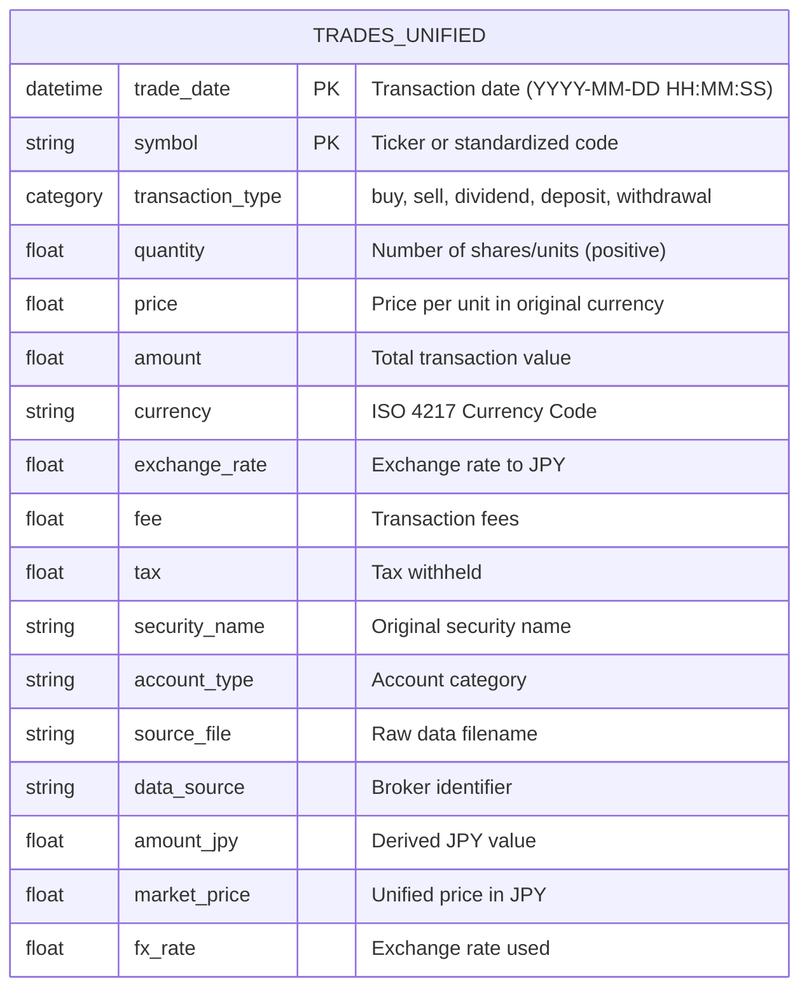
```mermaid
erDiagram
    TRADES_UNIFIED {
        datetime trade_date PK "Transaction date (YYYY-MM-DD HH:MM:SS)"
        string symbol PK "Ticker or standardized code"
        category transaction_type "buy, sell, dividend, deposit, withdrawal"
        float quantity "Number of shares/units (positive)"
        float price "Price per unit in original currency"
        float amount "Total transaction value"
        string currency "ISO 4217 Currency Code"
        float exchange_rate "Exchange rate to JPY"
        float fee "Transaction fees"
        float tax "Tax withheld"
        string security_name "Original security name"
        string account_type "Account category"
        string source_file "Raw data filename"
        string data_source "Broker identifier"
        float amount_jpy "Derived JPY value"
        float market_price "Unified price in JPY"
        float fx_rate "Exchange rate used"
    }
```

---

## Reference Data Entities

These entities provide market data used to calculate **current prices** and portfolio valuations.

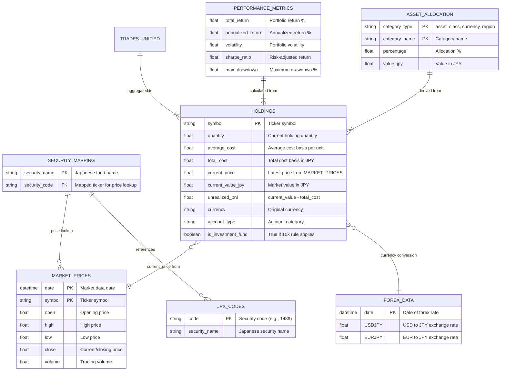
```mermaid
erDiagram
    MARKET_PRICES {
        datetime date PK "Market data date"
        string symbol PK "Ticker symbol"
        float open "Opening price"
        float high "High price"
        float low "Low price"
        float close "Current/closing price"
        float volume "Trading volume"
    }

    FOREX_DATA {
        datetime date PK "Date of forex rate"
        float USDJPY "USD to JPY exchange rate"
        float EURJPY "EUR to JPY exchange rate"
    }

    SECURITY_MAPPING {
        string security_name PK "Japanese fund name"
        string security_code FK "Mapped ticker for price lookup"
    }

    JPX_CODES {
        string code PK "Security code (e.g., 1489)"
        string security_name "Japanese security name"
    }

    HOLDINGS {
        string symbol PK "Ticker symbol"
        float quantity "Current holding quantity"
        float average_cost "Average cost basis per unit"
        float total_cost "Total cost basis in JPY"
        float current_price "Latest price from MARKET_PRICES"
        float current_value_jpy "Market value in JPY"
        float unrealized_pnl "current_value - total_cost"
        string currency "Original currency"
        string account_type "Account category"
        boolean is_investment_fund "True if 10k rule applies"
    }

    PERFORMANCE_METRICS {
        float total_return "Portfolio return %"
        float annualized_return "Annualized return %"
        float volatility "Portfolio volatility"
        float sharpe_ratio "Risk-adjusted return"
        float max_drawdown "Maximum drawdown %"
    }

    ASSET_ALLOCATION {
        string category_type PK "asset_class, currency, region"
        string category_name PK "Category name"
        float percentage "Allocation %"
        float value_jpy "Value in JPY"
    }

    %% Relationships
    TRADES_UNIFIED ||--|{ HOLDINGS : "aggregated to"
    SECURITY_MAPPING ||--o{ MARKET_PRICES : "price lookup"
    SECURITY_MAPPING ||--o{ JPX_CODES : "references"
    HOLDINGS }o--|| MARKET_PRICES : "current_price from"
    HOLDINGS }o--|| FOREX_DATA : "currency conversion"
    PERFORMANCE_METRICS ||--|{ HOLDINGS : "calculated from"
    ASSET_ALLOCATION ||--|{ HOLDINGS : "derived from"
```

### Current Price Flow

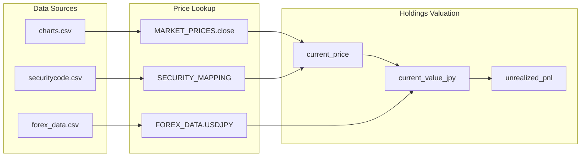
```mermaid
flowchart LR
    subgraph Data Sources
        C[charts.csv]
        F[forex_data.csv]
        S[securitycode.csv]
    end

    subgraph Price Lookup
        C --> MP[MARKET_PRICES.close]
        F --> FX[FOREX_DATA.USDJPY]
        S --> SM[SECURITY_MAPPING]
    end

    subgraph Holdings Valuation
        MP --> CP[current_price]
        SM --> CP
        CP --> CV[current_value_jpy]
        FX --> CV
        CV --> PNL[unrealized_pnl]
    end
```

| Entity | Data Source | Key Field |
|--------|-------------|-----------|
| `MARKET_PRICES` | `resources/charts.csv` | `close` = current price |
| `FOREX_DATA` | `resources/forex_data.csv` | `USDJPY`, `EURJPY` |
| `SECURITY_MAPPING` | `resources/securitycode.csv` | Maps fund names → tickers |
| `JPX_CODES` | `resources/jpxcodes.csv` | Japanese ETF/REIT codes |

## Entity Descriptions

### Primary Entities

#### TRADES_UNIFIED
The central entity storing all normalized trade transactions. This is the output of the data ingestion pipeline (`src/data/loaders.py`) and follows strict schema standards defined in `DATA_STANDARDS.md`.

**Key Business Rules:**
- All quantities must be positive
- `transaction_type` is normalized to: `buy`, `sell`, `dividend`, `deposit`, `withdrawal`
- `amount_jpy_unified` is derived: `amount * exchange_rate` for non-JPY trades

#### HOLDINGS
Aggregated current portfolio positions derived from TRADES_UNIFIED.

**Key Business Rules:**
- For Japanese Investment Trusts: `Market Value = (Quantity / 10000) * Current_Price`
- Holdings are grouped by symbol and account type

#### SECURITY_MAPPING
Maps Japanese fund names to standardized ticker symbols for price lookup.

**Data Source:** `resources/securitycode.csv`

#### MARKET_PRICES
Historical and current market price data for securities.

**Data Source:** `resources/charts.csv` (contains OHLCV data for ~60 symbols)

#### FOREX_DATA
Historical forex rates for currency conversion.

**Data Source:** `resources/forex_data.csv` (contains USDJPY, EURJPY rates from 2018)

#### JPX_CODES
Japanese exchange listed securities and their names.

**Data Source:** `resources/jpxcodes.csv` (contains ~430 Japanese ETF/REIT codes)

### Supporting Entities

#### BROKER_DATA_RAW
Tracks raw data files imported from different brokers with their specific encodings.

**Supported Brokers:**
- Rakuten Securities (JP stocks, US stocks, Investment Trusts, China stocks)
- SBI Securities (Domestic, Foreign)
- Monex Securities
- Wise (TransferWise)
- Binance (Crypto)

#### PERFORMANCE_METRICS
Calculated portfolio performance metrics.

**Data Model Source:** `src/analysis/models.py`

#### ASSET_ALLOCATION
Portfolio allocation breakdowns by various dimensions.

**Data Model Source:** `src/analysis/models.py`

## Data Flow

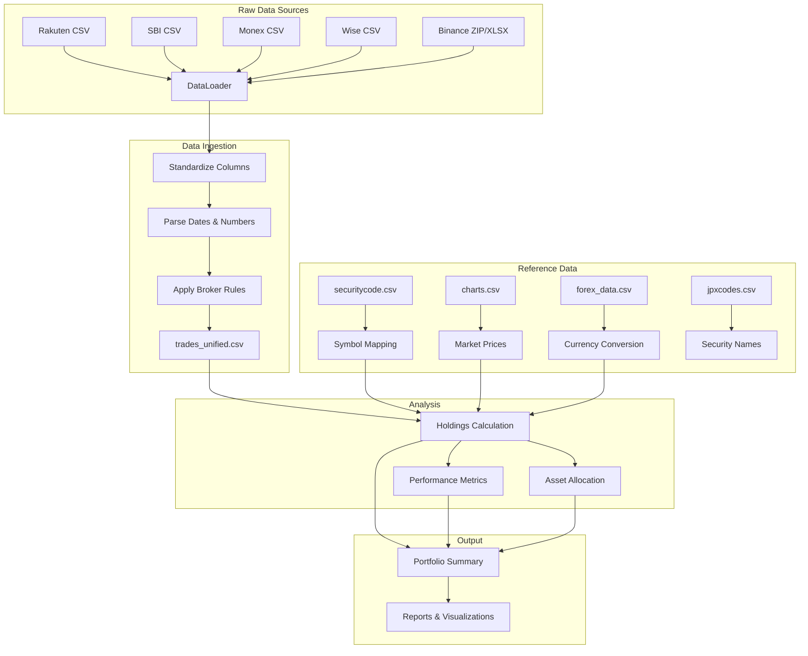
```mermaid
flowchart TD
    subgraph Raw Data Sources
        A[Rakuten CSV] --> D
        B[SBI CSV] --> D
        C[Monex CSV] --> D
        E[Wise CSV] --> D
        F[Binance ZIP/XLSX] --> D
    end

    subgraph Data Ingestion
        D[DataLoader] --> G[Standardize Columns]
        G --> H[Parse Dates & Numbers]
        H --> I[Apply Broker Rules]
        I --> J[trades_unified.csv]
    end

    subgraph Reference Data
        K[securitycode.csv] --> L[Symbol Mapping]
        M[charts.csv] --> N[Market Prices]
        O[forex_data.csv] --> P[Currency Conversion]
        Q[jpxcodes.csv] --> R[Security Names]
    end

    subgraph Analysis
        J --> S[Holdings Calculation]
        L --> S
        N --> S
        P --> S
        S --> T[Performance Metrics]
        S --> U[Asset Allocation]
    end

    subgraph Output
        S --> V[Portfolio Summary]
        T --> V
        U --> V
        V --> W[Reports & Visualizations]
    end
```

## Currency Conversion Logic

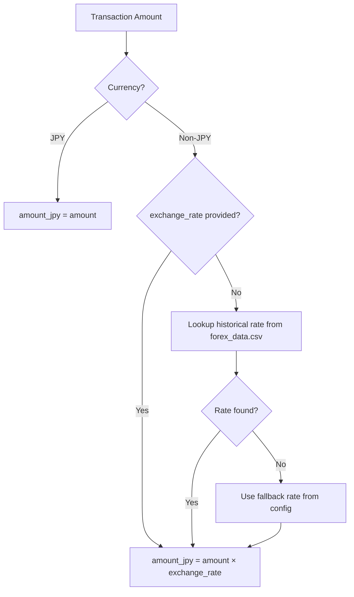
```mermaid
flowchart TD
    A[Transaction Amount] --> B{Currency?}
    B -->|JPY| C[amount_jpy = amount]
    B -->|Non-JPY| D{exchange_rate provided?}
    D -->|Yes| E[amount_jpy = amount × exchange_rate]
    D -->|No| F[Lookup historical rate from forex_data.csv]
    F --> G{Rate found?}
    G -->|Yes| E
    G -->|No| H[Use fallback rate from config]
    H --> E
```

## Fund Unit Normalization (10k Rule)

For Japanese Investment Trusts:

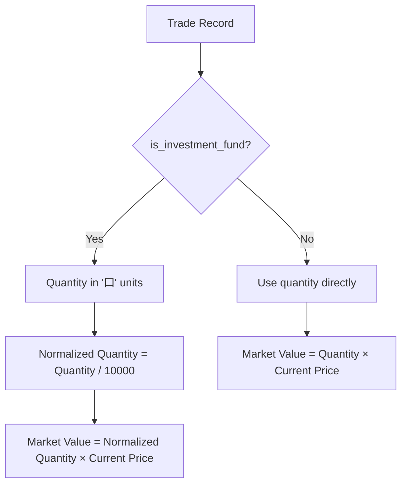
```mermaid
flowchart TD
    A[Trade Record] --> B{is_investment_fund?}
    B -->|Yes| C[Quantity in '口' units]
    C --> D[Normalized Quantity = Quantity / 10000]
    D --> E[Market Value = Normalized Quantity × Current Price]
    B -->|No| F[Use quantity directly]
    F --> G[Market Value = Quantity × Current Price]
```

## Configuration Reference

Key configuration from `resources/config.json`:

| Category | Key | Purpose |
|----------|-----|---------|
| **Forex** | `fallback_forex_rates` | Default rates when historical data unavailable |
| **Data** | `date_formats` | Supported date parsing formats |
| **Data** | `fallback_encodings` | CSV encoding fallback chain |
| **Analysis** | `fund_indicators` | Keywords to identify investment funds |
| **Analysis** | `etf_keywords` | Tickers recognized as ETFs |
| **Thresholds** | `high_concentration_pct` | Portfolio concentration warning threshold |
