**非常に重要なご指摘です！** 現在の設計は投資手段（Vehicle）ベースの分類になっていますが、ポートフォリオ分析では**投資対象の本質的な資産クラス**で分類すべきですね。

## 修正された資産クラス分類ロジック

### 現在の問題点
- **投資信託のゴールドファンド** → `投資信託`
- **日本のゴールド関連株** → `日本株`  
- **米国のゴールドETF** → `米国株`

### あるべき姿
- **投資信託のゴールドファンド** → `ゴールド`
- **日本のゴールド関連株** → `ゴールド`
- **米国のゴールドETF** → `ゴールド`

## 修正版：資産クラス判定フロー

```mermaid
flowchart TD
    ProcessedData[前処理済みデータ] --> AssetAnalysis{資産種別分析}
    
    %% 第1段階：ティッカーベース判定
    AssetAnalysis --> TickerCheck{統一ティッカー分析}
    
    TickerCheck -->|GLD,IAU,GLDM等| Gold[asset_class_major = 'コモディティ'asset_class_detail = 'ゴールド']
    TickerCheck -->|SLV,SIVR等| Silver[asset_class_major = 'コモディティ'asset_class_detail = 'シルバー']
    TickerCheck -->|VTI,VOO,SPY等| USEquity[asset_class_major = '株式'asset_class_detail = '米国株式']
    TickerCheck -->|ACWI,VWO等| GlobalEquity[asset_class_major = '株式'asset_class_detail = '海外株式']
    TickerCheck -->|BND,AGG等| Bond[asset_class_major = '債券'asset_class_detail = '債券']
    TickerCheck -->|VNQ,REIT等| REIT[asset_class_major = '不動産'asset_class_detail = 'REIT']
    TickerCheck -->|その他・不明| NameAnalysis{証券名分析}
    
    %% 第2段階：証券名ベース判定
    NameAnalysis -->|ゴールド/金/GOLD含む| GoldByName[asset_class_major = 'コモディティ'asset_class_detail = 'ゴールド']
    NameAnalysis -->|シルバー/銀/SILVER含む| SilverByName[asset_class_major = 'コモディティ'asset_class_detail = 'シルバー']
    NameAnalysis -->|原油/石油/OIL含む| Oil[asset_class_major = 'コモディティ'asset_class_detail = '原油']
    NameAnalysis -->|不動産/REIT含む| REITByName[asset_class_major = '不動産'asset_class_detail = 'REIT']
    NameAnalysis -->|債券/BOND含む| BondByName[asset_class_major = '債券'asset_class_detail = '債券']
    NameAnalysis -->|その他| LocationAnalysis{投資地域分析}
    
    %% 第3段階：投資地域ベース分類（株式）
    LocationAnalysis -->|日本/JP/TOPIX含む| JapanEquity[asset_class_major = '株式'asset_class_detail = '日本株式']
    LocationAnalysis -->|米国/US/S&P500含む| USEquityByName[asset_class_major = '株式'asset_class_detail = '米国株式']
    LocationAnalysis -->|新興国/EM含む| EmergingEquity[asset_class_major = '株式'asset_class_detail = '新興国株式']
    LocationAnalysis -->|全世界/WORLD含む| WorldEquity[asset_class_major = '株式'asset_class_detail = '全世界株式']
    LocationAnalysis -->|欧州/EUR含む| EuropeEquity[asset_class_major = '株式'asset_class_detail = '欧州株式']
    LocationAnalysis -->|その他| VehicleAnalysis{投資手段分析}
    
    %% 第4段階：投資手段分類（フォールバック）
    VehicleAnalysis -->|MMF含む| MMF[asset_class_major = '現金同等物'asset_class_detail = 'MMF']
    VehicleAnalysis -->|外貨預金| Deposit[asset_class_major = '現金同等物'asset_class_detail = '外貨預金']
    VehicleAnalysis -->|その他| Other[asset_class_major = 'その他'asset_class_detail = '未分類']
    
    %% 投資手段フラグ設定
    Gold --> SetFlags{投資手段フラグ設定}
    Silver --> SetFlags
    USEquity --> SetFlags
    GlobalEquity --> SetFlags
    Bond --> SetFlags
    REIT --> SetFlags
    GoldByName --> SetFlags
    SilverByName --> SetFlags
    Oil --> SetFlags
    REITByName --> SetFlags
    BondByName --> SetFlags
    JapanEquity --> SetFlags
    USEquityByName --> SetFlags
    EmergingEquity --> SetFlags
    WorldEquity --> SetFlags
    EuropeEquity --> SetFlags
    MMF --> SetFlags
    Deposit --> SetFlags
    Other --> SetFlags
    
    %% 投資手段フラグ（補助情報として保持）
    SetFlags --> VehicleFlags[投資手段フラグ設定:is_investment_fundis_japan_stockis_us_stockis_etfis_mmf]
    
    VehicleFlags --> FinalOutput[統一データシート出力]
    FinalOutput --> End([完了])
    
    %% スタイリング
    classDef commodity fill:#ffd700
    classDef equity fill:#90ee90
    classDef bond fill:#add8e6
    classDef reit fill:#dda0dd
    classDef cash fill:#f0e68c
    
    class Gold,Silver,GoldByName,SilverByName,Oil commodity
    class USEquity,GlobalEquity,JapanEquity,USEquityByName,EmergingEquity,WorldEquity,EuropeEquity equity
    class Bond,BondByName bond
    class REIT,REITByName reit
    class MMF,Deposit cash
```



## 修正された論理式

### 1. **資産クラス判定の優先順位**

```python
def determine_asset_class(row):
    """
    修正版：資産クラス判定（投資対象ベース）
    """
    unified_ticker = str(row.get('unified_ticker', ''))
    security_name = str(row.get('security_name', '')).upper()
    
    # 第1優先：ティッカーベース判定
    ticker_asset_mappings = {
        # コモディティ
        'GLD': ('コモディティ', 'ゴールド'),
        'IAU': ('コモディティ', 'ゴールド'), 
        'GLDM': ('コモディティ', 'ゴールド'),
        'SLV': ('コモディティ', 'シルバー'),
        'SIVR': ('コモディティ', 'シルバー'),
        'USO': ('コモディティ', '原油'),
        'UCO': ('コモディティ', '原油'),
        
        # 株式（地域別）
        'VTI': ('株式', '米国株式'),
        'VOO': ('株式', '米国株式'),
        'SPY': ('株式', '米国株式'),
        'QQQ': ('株式', '米国株式'),
        'ACWI': ('株式', '全世界株式'),
        'VWO': ('株式', '新興国株式'),
        'EFA': ('株式', '先進国株式'),
        'TOPIX': ('株式', '日本株式'),
        
        # 債券
        'BND': ('債券', '米国債券'),
        'AGG': ('債券', '米国債券'),
        'TLT': ('債券', '米国長期債'),
        
        # 不動産
        'VNQ': ('不動産', 'REIT'),
        'RWR': ('不動産', 'REIT')
    }
    
    if unified_ticker in ticker_asset_mappings:
        major, detail = ticker_asset_mappings[unified_ticker]
        return major, detail
    
    # 第2優先：証券名キーワード判定
    name_patterns = {
        # コモディティ
        ('ゴールド', '金', 'GOLD'): ('コモディティ', 'ゴールド'),
        ('シルバー', '銀', 'SILVER'): ('コモディティ', 'シルバー'),
        ('原油', '石油', 'OIL', 'CRUDE'): ('コモディティ', '原油'),
        ('コモディティ', 'COMMODITY'): ('コモディティ', '商品'),
        
        # 不動産
        ('不動産', 'REIT', 'リート'): ('不動産', 'REIT'),
        
        # 債券
        ('債券', 'BOND', 'ボンド'): ('債券', '債券'),
        
        # 地域別株式
        ('日本', 'JAPAN', 'TOPIX', 'NIKKEI'): ('株式', '日本株式'),
        ('米国', 'US', 'S&P500', 'NASDAQ'): ('株式', '米国株式'),
        ('新興国', 'EMERGING', 'EM'): ('株式', '新興国株式'),
        ('全世界', 'WORLD', 'GLOBAL', 'オール・カントリー'): ('株式', '全世界株式'),
        ('欧州', 'EUROPE', 'EUR'): ('株式', '欧州株式')
    }
    
    for keywords, (major, detail) in name_patterns.items():
        if any(keyword in security_name for keyword in keywords):
            return major, detail
    
    # 第3優先：投資手段ベース分類（フォールバック）
    if 'MMF' in security_name or 'MONEY MARKET' in security_name:
        return '現金同等物', 'MMF'
    
    if row.get('is_investment_fund', False):
        return '投資信託', 'その他投資信託'
    
    # デフォルト：投資地域で分類
    file_source = row.get('data_source', '')
    if 'JP' in file_source or 'SaveFile' in file_source:
        return '株式', '日本株式'
    elif 'US' in file_source:
        return '株式', '米国株式'
    elif 'CH' in file_source:
        return '株式', '中国・香港株式'
    
    return 'その他', '未分類'
```

### 2. **統一データシート最終版**

```python
FINAL_UNIFIED_SCHEMA = {
    'security_name': str,           # 証券名
    'ticker_code': str,             # ティッカーコード（元データ）
    'unified_ticker': str,          # 統一ティッカーコード
    'quantity': float,              # 数量
    'price': float,                 # 価格（元通貨）
    'volume': float,                # ボリューム（JPY統一）
    'exchange_rate': float,         # 為替レート
    'currency': str,                # 通貨
    'unified_price_jpy': float,     # 統一取引価格日本円
    
    # 投資手段フラグ（補助情報）
    'is_investment_fund': bool,     # 投資信託フラグ
    'is_japan_stock': bool,         # 日本株フラグ
    'is_us_stock': bool,           # 米国株フラグ
    'is_etf': bool,                # ETFフラグ
    'is_mmf': bool,                # MMFフラグ
    
    'trade_date': datetime,         # 取引日
    
    # メイン分類（投資対象ベース）
    'asset_class_major': str,       # 株式、債券、コモディティ、不動産、現金同等物
    'asset_class_detail': str       # ゴールド、米国株式、日本株式、REIT等
}
```

### 3. **実装例**

```python
# 修正前の分類
{
    'security_name': 'SPDR Gold Trust',
    'unified_ticker': 'GLD',
    'asset_class_major': '米国株',  # 間違い
    'asset_class_detail': '米国ETF'
}

# 修正後の分類
{
    'security_name': 'SPDR Gold Trust', 
    'unified_ticker': 'GLD',
    'is_us_stock': True,           # 投資手段情報
    'is_etf': True,               # 投資手段情報
    'asset_class_major': 'コモディティ',  # 正しい投資対象
    'asset_class_detail': 'ゴールド'      # 正しい投資対象詳細
}
```

この修正により、**投資信託のゴールドファンド**、**日本のゴールド関連株**、**米国のゴールドETF**すべてが`asset_class_major = 'コモディティ'`、`asset_class_detail = 'ゴールド'`として統一分類され、真のポートフォリオ分析が可能になります。